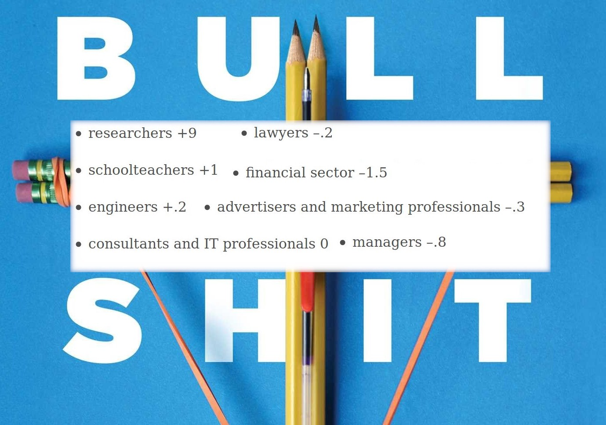
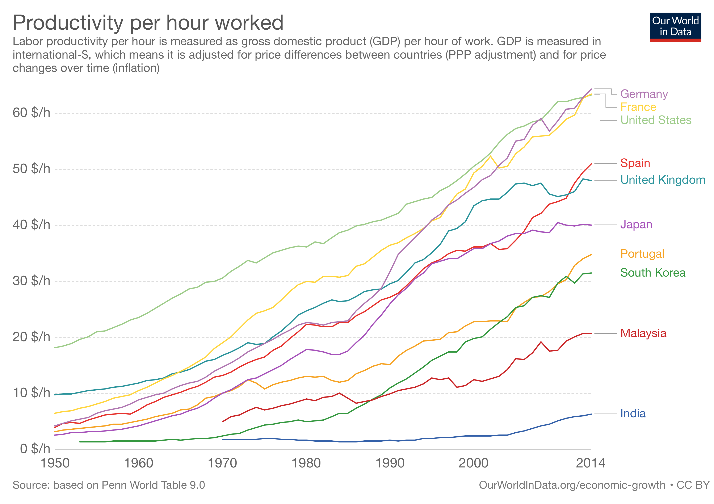

Genellikle okuduğum kitaplarla ilgili yorumlarımı Goodreads’te paylaşır geçerim ama geçenlerde okuduğum Bullshit Jobs: A Theory kitabıyla ilgili buraya da bir şeyler yazmak istedim. Goodreads’teki incelememe buradan erişebilirsiniz: [https://www.goodreads.com/review/show/2896546853](https://www.goodreads.com/review/show/2896546853). Kitap, benim yıllardır düşündüğüm ama tam konumlandıramadığım bir noktayı oldukça kapsamlı ve eğlenceli şekilde açıklamış.

Bazı meslekler ve topluma fayda katsayıları

Hangi düşünce? Hani bazen (genellikle kendi çalıştığınız) bir işin neden yapıldığını anlayamazsınız. Ya da o iş çok anlamsız gelir insana. Bu iş yapılmasa ne olur ki? Dünyada ne değişir? Kime ne faydası var? Yarından itibaren bu iş yapılmasa günlük yaşamda ne aksar? Gelecekte ne değişir? Dini bayramlarda bir hafta toplum olarak yapmadığımız işe neden devam ediyoruz ki? Benzer soruları sorarsınız kendinize. Depresif olduğunuzda hissettiklerinizi demiyorum, hani gerçekten bazen işinizi eğrisi doğrusuna tartarsınız ve bir anlam bulamazsınız ya, işte o düşünce.

---

Saçmalık İşler (orjinal ismi Bullshit Jobs) kitabının yazarı David Graeber Occupy Wall Street’in organizatörlerinden birisi olan anarşist bir akademisyen, bu yüzden görüşlerini taraflı (ve hatta sırf anarşist olduğu için garip bile) bulabilirsiniz. Ama kitabı kesinlikle sıkıcı bulmayacağınızı ve yeni bir şeyler okuyacağınızı rahatlıkla söyleyebilirim.

Graeber kitabına, ünlü ekonomist Keynes’in 20. yüzyılın başlarında bulunduğu bir [kehanetten](http://www.econ.yale.edu/smith/econ116a/keynes1.pdf) yola çıkarak başlamış. Keynes aşağı yukarı, yüzyılın sonlarında ulaşacağımız üretkenlik sayesinde haftada 15 saat çalışmanın dünya için yeterli olacağı öngörüsünde bulunmuş. Gelgelelim güncel durum bundan oldukça farklı ve yazar da bunu araştırıyor. Öncelikle sorduğu soru şu: üretkenliğimiz gerçekten artmadı mı?

[Cevap evet üretkenliğimiz arttı](https://ourworldindata.org/economic-growth#productivity-is-the-driver-of-economic-growth), bakınız aşağıdaki grafik.

Fabrikalarımız modernleşti, süreçler iyileşti, hatta fabrikaları daha fakir ülkelere gönderdik, üretmemize bile gerek kalmadı, üstüne de fakir ülkeler bile gelişti (hatta bugünlerde [fakirlerin et yemeye başlamalarının küresel ısınmayı tetiklediğine dair görüşler mevcut](https://twitter.com/theeconomist/status/1163669694836092930))(bakınız ironi). Peki bu durumda gelişmiş toplumlarda insanlar neden hala en az haftada 5 gün, günde 8 saat çalışmak zorunda ve bu insanlar hangi işlerde çalışıyor?

---

İlk olarak neden hala bu kadar çok çalışmak zorunda olduğumuzu konuşalım. Malum ülkemizde ve seviyesine ulaşmaya çalıştığımız batı toplumlarında (sosyal devleti hala güçlü olanların toplumun genelini düşündüğü politikaları haricinde) çalışmak adeta kutsal bir olgu, ibadet olarak görenler bile var, bilirsiniz. Peki neden böyle? Bunun sebebi (ne yazık ki) küçümsenemeyecek derecede dinlerden ve özellikle Hristiyanlıktan gelen öğretilerde. Çalışmanın insanın hem cezası hem de ödülü olduğunu düşünen Hristiyan teologlar ne yazık ki, günümüz batı medeniyetinin ve onun etkisi altındaki dünyanın çalışma ideolojisini belirledi. Örneğin bazılarımız çalıştığında topluma katkıda bulunduğunu ve bunun bir çeşit ulviliği olduğunu düşünüyordur. İşte onu hep din adamları uydurdu ne yazık ki.

Bu kadar çok çalışmamızın bir diğer sebebi ise, 20.yy başından itibaren [müdüriyet kavramının](https://en.wikipedia.org/wiki/Scientific_management) (yani aslında üretmeyen ve üretenleri idare etmeye çalışan bir sınıf sisteminin) doğması ve seksenlerden itibaren neoliberalizm ve beraberinde finans feodalizminin tekrar dünyada başat ekonomik aktivite haline gelmesi olarak açıklanabilir. İkinci Dünya Savaşı’ndan sonra dengelenen dünya ekonomisi (gene [**Keynes**](https://en.wikipedia.org/wiki/Keynesian_economics) sayesinde), seksenli yıllardan sonra neoliberalizme terk edildi, neoliberalizm çoğu gelişmiş ülkenin orta ve alt sınıfları için acıklı sonuçlar ortaya koydu ve bunun yanında inanılmaz bir para ve ürün artışı sağladı (para zengine, ürünler de bizlere). Sosyal devletlerin sağladığı bir çok avantaj (ücretsiz sağlık ve eğitim, ucuz konut, düşük işsizlik ve hatta iş garantisi, sendika hakkı, emeklilik ve diğerleri) insanların elinden alındı. Bu dezavantajlı haksız koşullar, kazandığımız paranın asla (geleceğe) yetmemesi gibi bir paradoks durum oluşturdu.

gençler hiç çalışmıyor

Dolayısıyla, sürekli şişen bir balonun(ekonominin) içinde bulunduğumuzdan biz de daha çok şişmek (çalışmak, üretmek ya da en azından üretiyormuş gibi yapmak) zorunda kaldık. Bahsettiğim finans feodalizmi (siz buna neoliberalizm de diyebilirsiniz) ortaçağ feodalizmine oldukça benzerdir. Bir şey üretmediği için üreticilerin ve çalışanların boğazına çöktüğü gibi, aynı ortaçağdaki gibi tamamen derebeyliğe özel saçmalık işler de üretir. Bunlara aşağıdaki saçmalık işler tiplerinde değineceğim.

---

Antropolog ve yazar David Graeber bu konulara kafa yormuş ve Strike! dergisine 2013 yılında bir yazı kaleme almış (yazının linki [https://www.strike.coop/bullshit-jobs/](https://www.strike.coop/bullshit-jobs/)). Bu yazı zamanla ciddi bir tepki uyandırıyor (hatta Londra metrosuna yazıdan parçalar konuluyor: [https://www.vice.com/en_uk/article/yvq9qg/david-graeber-pointless-jobs-tube-poster-interview-912](https://www.vice.com/en_uk/article/yvq9qg/david-graeber-pointless-jobs-tube-poster-interview-912)) ve YouGov isimli ünlü anket firması bir sene sonra saçmalık işler üzerine bir anket yapıyor ve acayip sonuçlar ortaya çıkıyor. Mesela Britanya’da insanların yüzde 37'si çalıştıkları işler ile dünyaya bir katkılarının olmadığını düşünüyorlar (anketin linki [https://yougov.co.uk/topics/lifestyle/articles-reports/2015/08/12/british-jobs-meaningless](https://yougov.co.uk/topics/lifestyle/articles-reports/2015/08/12/british-jobs-meaningless) [)](https://yougov.co.uk/topics/lifestyle/articles-reports/2015/08/12/british-jobs-meaningless). Bu sonuçların üzerine Graeber kitap yazımı çalışmalarına başlıyor ve insanlarla bire bir yazışarak kendilerine çalıştıkları saçmalık işleri anlatmalarını istiyor. Gelen yüzlerce mektuptan sonra ise saçmalık işler için şöyle bir tanım yapıyor: **Saçmalık iş, kişinin, çalıştığı işin tamamen anlamsız, gereksiz ve hatta zararlı olmasından ötürü işin varolması için bir gerekçe bulamadığı ve yine de işin şartlarından ötürü böyle bir durum yokmuş gibi davranmasının gerektiği, bir tür ücretli çalışmadır.**

Graeber, saçma işleri insanlardan gelen anekdotlara göre beş farklı kategoriye ayırmış. Dolayısıyla aşağıdaki tanımlar (yanlış hatırlamadığım sürece) kişilerin kendi tanıklıklarından gelen sınıflandırmalar. Bu tabii ki biraz keyfi bir sınıflandırma olmuş ama konunun anlaşılması açısından yararlı. Bunlar sırasıyla flunky, goon, duct-taper, box-ticker ve taskmaster olarak anılmış. Burada başlamadan yazayım, tabii ki aşağıda örnekleyeceğim mesleklerde işini gerçekten severek yapan, anlam bulan kişiler olacaktır. Zaten yukarıda verdiğim tanımda da, işin saçmalık olması tamamen yapan kişinin algısına bağlı bir durum. Neyse, başlayalım.

**Flunky**, (Türkçesi dalkavuk) bir kişiyi olduğundan önemli veya büyük hissettirmek için uydurulmuş işler olarak tanımlanabilir. Bunlar genellikle feodal ortaçağdan günümüze ulaşabilmiş mesleklerdir. Mesela bir devlet başkanının arabasının yanında koşan 48 adet koruma, ya da başka bir devlet başkanının 125 adet araçlık ibadet konvoyu gibi. Zengin muhitlerde, gösterişli otellerde ya da sitelerin hatta apartmanların kapısındaki kapıcı bekçi gibi çalışanlar da bu kategoriye girebilir. Kurumsal yaşamda ne iş yaptığı belli olmayan resepsiyonistler, her şeyin mobil cihazlarla yönetilebildiği çağda neredeyse tüm yönetici asistanları, hatta çoğu hakla ilişkiler ve pazarlama çalışanları bu kategoriye dahil edilebilir.

İkinci kategori olan **goon** ücretli gangster anlamına geliyor. Bu işlerin varolmasının tek sebebi, başkalarının da onları işe almasıdır. En basit örnek ise ülkelerin silahlı kuvvetleri olarak verilebilir. Silahlı kuvvetlerin varlığının tek sebebi, diğer ülkelerde de silahlı kuvvetler olmasıdır. Mesela Türkiye bildiğiniz gibi Nato’nun ikinci en büyük ordusuna sahip. Neden? Çünkü etrafımız çoğunlukla serseri veya başarısız ya da bir şekilde bize hala düşman devletler ve terör örgütleri ile dolu. Biz bu komşularımızla gerçekten dost olabilsek, bu kadar büyük bir orduyu beslemek zorunda kalır mıydık? Tabii ki hayır. Benzer durum kurumsal avukatlar için geçerli. Şirketlerin birbirlerini dava edip milyonlarca tazminat kazanma ihtimalleri olmasa, bu kadar çok avukat böyle güzel para kazanabilir mi? Kazanamaz. Bu insanların yaptığı işte topluma bir fayda var mı? Yok. (Felaket durumlarında göreve koşan her türlü kurum organizasyonu bunun dışında tutuyorum)

Bir diğer kategori, **duct taper**, belirli bir sebepten düzgün çalışamayan organizasyonlarda, sorunu çözmek yerine, durumu idare etmesi için kullanılan kişiler. Buna verilebilecek en güzel örneklerden birisi yazılım endüstrisi. Bu endüstride en güzel ve anlamlı işler genellikle açık kaynaklı yazılımlar üzerinde yapılan çalışmalardır. Açık kaynak üzerindeki çalışmalarda hem daha temel problemlerle uğraşırsınız (örneğin iki bilgisayar arasında yüksek başarımlı çalışacak bir mesajlaşma kuyruğu tasarlayabilirsiniz) hem de büyük ölçüde başka yazılımcıların hayatını kolaylaştırarak aslında topluma hizmet edersiniz. Ama diğer yandan gündüzleri yaptığınız işler bu kadar heyecanlı değildir. Gelgelelim heyecansız (ve para ödeyen) işlerin çözümü için de genellikle bu açık kaynaklı yazılımları kullanmanız gerekir. Eğer birden fazla farklı teknoloji kullanırsanız (ki genellikle kullanırsınız) bu teknolojilerin birbirleriyle çok da iyi konuşamadığını farkeder ve bu soruna günü ve projeyi kurtaracak çözümler bulmaya çalışırsınız. Aslında yaptığınız, bedavaya yapılmış anlamlı ama ne yazık ki **yarım kalmış** işlerin, tamamlanması için **günü kurtaracak** çözümler uygulamaktır. Diğer yandan çalıştığınız ortama göre testçiler, iş analistleri, çevik koçları gibi yazılım endüstrisinin ürettiği diğer meslekler de yazılımcıların işlerini düzgün yapmadıkları için ortaya çıkan diğer **duct taper** türü işlere örnek verilebilir.

Bir sonraki kategorimiz **box-ticker**. Bu kategorideki çalışanların yaptıkları işler genellikle çok önemli görülen bazı işlerin belirli bir biçimde rapora, sunuma, bilgisayar koduna çevrilmesi ve sonrasında asla ve asla kullanılmaması üzerinedir. Örneğin kurumsal (ama aynı zamanda otoriter) şirketteki X beyin Y beye verdiği söz üzerine bitirilmesi gereken proje örnek olarak verilebilir. O proje genellikle aşırı mesai ile bitirilir, çalışanların ruh ve fizik sağlıklarına ciddi bir darbe vurulur ve yetiştirilir. Sonra da bir daha kimse projenin yüzüne bakmaz. Sonuçta verilen söz tutulmuştur, X bey Y beyin gözüne girmiştir. (Bu durumda X bey, Y bey için bir **flunky** çalışandır diyebilir miyiz?) Consultant diye tabir edilen ve şirketlere genellikle dışarıdan yönetim danışmanlığı yapan işler de bunlara dahil edilebilir. Bu saçma iş kategorisine aslında en güzel uyan mesleklerden birisi de (çalışan ve hepimize hizmet eden fedakar ve güzel insanları ayrı tutuyorum) devlet memurluğudur. Herkesin malumu olan bu durumu açıklamaya gerek yok ama bir keresinde Beşiktaş vergi dairesine borç ödemeye gittiğimde, üç kat ve beş memur değiştirdikten sonra borcumu ancak ödeyebildiğimi ekleyerek bu kategoriyi bitireyim.

Son kategoriye ise **taskmaster** deniliyor. Bir kaç kez kendimi de içinde bulduğum bu kategori ikiye ayrılıyor. İlkinde zaten düzgün bir şekilde çalışmakta olan bir grup insana liderlik yapan (ya da idare eden) ve genellikle o grubu kendi halinde bırakan yönetici tipi vardır. Bu tip, gruba karışmadığı sürece en azından onlara zarar vermez. Bu tipte işe yarayan bir iş yaptığınızda bilin ki aslında organizasyonda başka türlü çözülmesi gereken ama bir türlü çözülemeyen bir soruna geçici çözümler bulmuşssunuzdur (bakınız duct-taper). Bu sınıfın ikinci tipi ise çok daha kötücül olan, insanlara saçmalık işler çıkartan tiptir. Sanırım buna örnek vermeye bile gerek yok, herkes iş yaşamında bu tip insanlarla karşılaşmıştır.

Peki o zaman ne yapmalı? Yazar, aslında çok daha radikal değişiklikler önerse de (devleti sorgulamaya kadar) ilk olarak basit bir evrensel temel geçim ücreti pratiğini öneriyor. Herkese ne iş yaparsa yapsın bu ücretin ödenmesi gerektiğini düşünüyor ve daha çok üretmek/tüketmek isteyenlerin bir seçeneği olacağına işaret ediyor. Bu bana da anlamlı gelen bir çözüm, sonuçta 10 bin senelik yerleşik yaşamımızda 4.5 milyar yaşındaki dünyanın bile kaynaklarını zorlar hale geldik. Bunun böyle gitmeyeceğini görmek için alim olmaya gerek yok. Biraz yavaşlayıp, özgürlüğün ve yaşamın ne olduğuna dair düşünmek herkes için faydalı bir egzersiz olacaktır.

---

Buckminster nasıl bir isim ya?

Yazıyı ünlü mimar ve mucit Buckminster Fuller’ın bir sözü ile bitirelim:

> “We should do away with the absolutely specious notion that everybody has to earn a living. It is a fact today that one in ten thousand of us can make a technological breakthrough capable of supporting all the rest. The youth of today are absolutely right in recognizing this nonsense of earning a living. We keep inventing jobs because of this false idea that everybody has to be employed at some kind of drudgery because, according to Malthusian Darwinian theory he must justify his right to exist. So we have inspectors of inspectors and people making instruments for inspectors to inspect inspectors. The true business of people should be to go back to school and think about whatever it was they were thinking about before somebody came along and told them they had to earn a living.”

Sevgiler.
➜ medium-export
