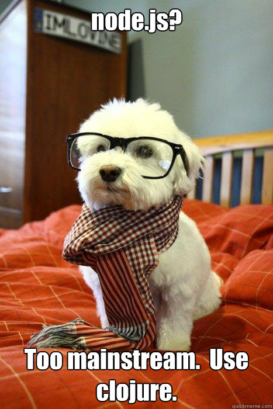

## First Class Citizens

<br/>



<br/>

Since I already made the notion of parentheses in Clojure clear here: [https://erkinunlu.net/blog/clojure_parentheses](https://erkinunlu.net/blog/clojure_parentheses), today I'd like to talk about functions which are the backbone of any programming language out there and they are the source of joy in Clojure for me as well. In functional languages, functions are obviously first class citizens. This means that they are values which you can store, pass around, and return from functions. 

## Basic syntax

```clojure
(defn add
  "adds x to y and returns the result"
  [x y]
  (+ x y))
```

`defn` creates a named function here called `add`.  You can then add comments about your functions for users who are interested about the code itself. The `[x y]` is the parameters vector. This notion is another example of the code as data approach of Clojure as a vector is just a basic data type available in Clojure. The part coming after the parameters is the function body: it returns the result of the last expression in it which is `(+ x y)` which is basically another call of the function `+`. 

```clojure
(add 1 2)
=> 3
```

## Anonymous functions

You can also create anonymous functions with `fn` macro in Clojure. This is especially useful when used with higher order functions, we are going to use it a bit different than you'd expect to see in a Clojure code base. 

```clojure
(def add-function (fn [x y] (+ x y)))
```

Above we basically created the same function: this time we created the function with `fn` and bind the resulting function value to `add-function` symbol. As you can see, this is longer than just using `defn`. Actually, `defn` is just a macro that gets a name and function body and associates them together.

## Arguments

Passing arguments to a function is very simple in Clojure, you just pass them by their order. But since we don't have static typing in the language, it might get tedious to remember what exactly to pass when. It's always best to keep your functions simple and short. 

### Passing maps for named parameters

If you're also a fan of passing named arguments to your function like me and can't find the support in Clojure, you can always use the technique of passing a map and then destructure your arguments from the specified map. I probably have to talk about destructuring in another post but this small example should suffice for now. 

```clojure
(defn greeter [{:keys [name age]}]
  (str "person " name ", is " age " years old"))

(greeter {:name "erkin" :age 34})
=> "person erkin, is 34 years old"
```

As you can see this is a bit safer and easier to remember when invoking the function. If you combine this technique with specs you can get more safety. Otherwise, you can still shoot yourself in the foot but it's harder now: 

```clojure
(greeter {:name 34 :age "erkin"})
=> "person 34, is erkin years old"
```

## Short version for anonymous functions

There's also a short version of the anonymous function syntax which we can call the `lambda syntax` and it is helpful with higher order functions like map, filter and reduce. A quick example would be:

```clojure
(map #(str "Hi There: " %) ["Erkin" "Gizem"])
```

The part `#(str "Hi There: " %)` is the short form function. The `#` indicates the start of the function and  `%` indicates the argument passed. This is a neat way of keeping code short and concise but remember: keep it short to prevent an unreadable mess. 

## Maps and Keywords are functions as well!

Consider the following Java code for accessing elements in a map:

```java
Map<String, String> someMap = new HashMap<>();
someMap.put("name", "Erkin");
String name = someMap.get("name");
System.out.println(name);
```

You can achieve the same with the below Clojure snippet: 

```clojure
(-> 
  {:name "Erkin"}
  :name
  prn)
"Erkin"
```

What just happened? And how much less code we have just written! Anyway, let me explain bit by bit:

- `->` is something called a threading macro, don't worry about it for now, just know that the code will be processed from top to bottom, it will carry the result to the next line as we go.
- `{:name "Erkin"}` is the same map I created with Java above in 2 lines.
- `:name` is the name keyword, as you can see, it acted as a function and get the value keyed to `:name` from the map
- `prn` is just the printing function and we print the value `"Erkin"` to console.

So to paraphrase it we can take a look at the following piece:

```clojure
(:name {:name "Erkin"})
=> "Erkin"
```

This is what Rich Hickey refers to "[Simple, made Easy](https://www.youtube.com/watch?v=oytL881p-nQ)". Same also goes for the map itself:

```clojure
(def person {:name "Erkin" :age 34})
=> #'user/person
(person :age)
=> 34
```

This is a very pragmatic approach taken by the designers of the language intended to make our lives easier and simpler. 

## Conclusion

As you can see functions are very easy to write in Clojure and they are the backbone of the language. I will follow up this post with **let bindings, threading macros and higher order functions** on my next posts. I hope the post is clear enough but please reach out to me if you have any questions.