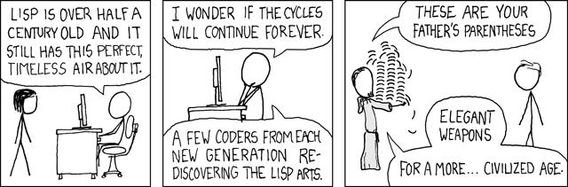
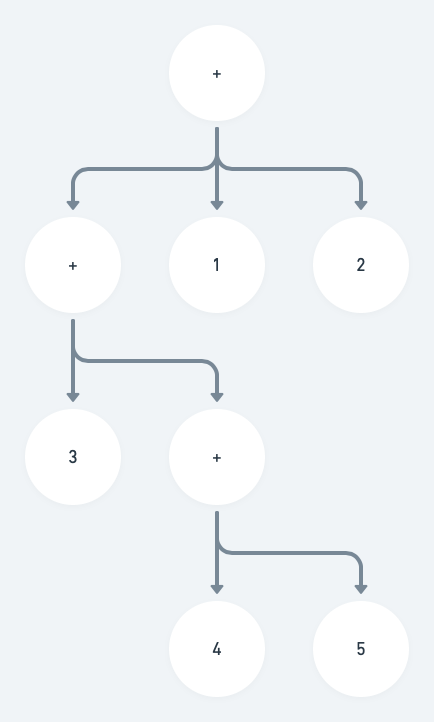

## Hard to read! Really?

<br/>



<br/>
They say the hardest thing about learning a lisp-like language such as Clojure is the parenthesis syntax. I am going to show that this is not the case and in fact make another bold claim that Clojure's syntax is actually very very simple.

So lets dive in:

```clojure
(map inc [1 2 3 4 5])
```

<br/>

People would look at the above function invocation and claim that it is abnormal. Let's see if that's the case.

Parentheses in Clojure are used to call **things**. But what are these things? Without going into further details, we can list them as:

- Functions → These are what we will be discussing here today, the arguments to a function are evaluated and then passed to the function itself.
- Special forms → These are the small number of language constructs that provide the basics like **def**ining something, **if** itself, **try**-**catch** etc. You can see the full list [here](https://clojure.org/reference/special_forms).
- Macros → These are really similar to functions but subtly different. Main difference is, Clojure does not evaluate the arguments passed to a macro, rather the final form that's produced by the macro gets to be evaluated. It's not the point of this post, so don't worry if this doesn't make sense right now. You can read more about macros in Clojure from this free online book [here](https://www.braveclojure.com/read-and-eval/).

## So what happens?

Basically these steps happen in a sequence:

1. A left parentheses means that we are now calling a function.
2. Then comes `map` part, that is the function name. We are going to call the `map` function
3. The rest are arguments to the function, `inc` is the function to increase numbers by 1 and `[1 2 3 4 5]` is a vector of those numbers.
4. Right parenthesis means that the list of arguments are done so we can now apply the arguments to our function body.
5. We get the returned result.

```clojure
(map inc [1 2 3 4 5])
=> (2 3 4 5 6)
```

<br/>
This is it!

## Should you care though?

First of all, I know that programmers are really into this ["Strong Opinions, Weakly Held"](https://www.saffo.com/02008/07/26/strong-opinions-weakly-held/) concept and they are using it really wrong IMHO. This actual essay talks about forecasting about a decision and then trying systematically to prove yourself wrong. Hopefully that process is going to leave you with a nice and sound hypothesis about a future event's likelihood of happening in a way you predicted (If you followed the same technique, by now I should have at least a bit conviced you that the above syntax is not weird or impossible to understand). But instead us programmers are usually use this concept to just pass around our personal tastes and judgements about things and ideas as facts. Like backend programmers dissing Javascript all the time (hating Javascript is so 2010s by the way); these are usually really wrong. So is the idea that Clojure's syntax being weird. But nevertheless one should not base their judgement about the usability of a language purely on syntax. That is not how serious programmers would think. (This syntax is actually a blessing in disguise, so read on)

## But why these parenthesis?

Actually there's a very clever reason for this syntax structure. Imagine the following nested function calls:

```clojure
(+ 1 2 (+ 3 (+ 4 5)))
=> 15
```

<br/>

How does Clojure's REPL handle this function call? Like most programming languages, it needs to convert this code into an Abstract Syntax Tree (AST) which will then need to be passed to an evaluator. Trees are known to be easily defined using lists, the first element of the list would be the root of the tree, rest of the elements would be the children of the tree. Coincidence is, Clojure's function calls are also designed as list structures! Therefore `(+ 1 2)` is actually a list with three elements that represents a tree with `+` as the root, and `1 2` are the children! So the above function call's AST could be visualized as



So we can tell how the above is evaluated:

1. (+ 4 5) ⇒ 9
2. (+ 3 9) ⇒ 12
3. (+ 1 2 12) ⇒ 15

<br/>

This further enables us to do a lot of magic with the same Clojure code that we write daily. As you can easily follow from the tree, evaluator can pick the rest of trees that are needed to be evaluated for the root of each tree. It's basic in-depth tree traversal. This feature of ASTs being actual lists in Clojure code is what makes Clojure macros this powerful and easy to use!

## Verdict

I hope by now I persuaded you to try your hand in Lisp sytyle languages, since they are not so scary anymore! I may have ventured a bit too far into some advanced topics but if you have any questions, do not hesitate to contact me via email.
